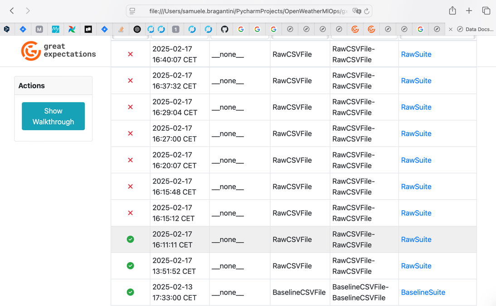
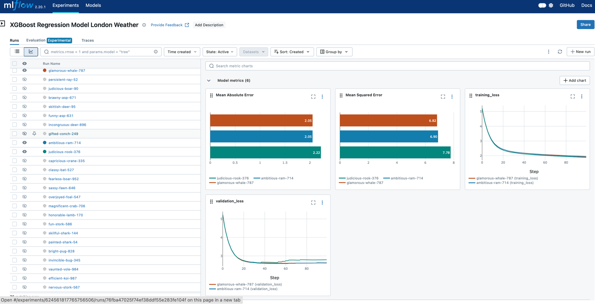
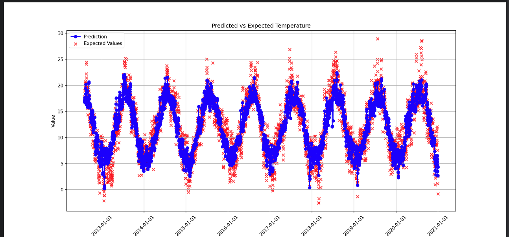
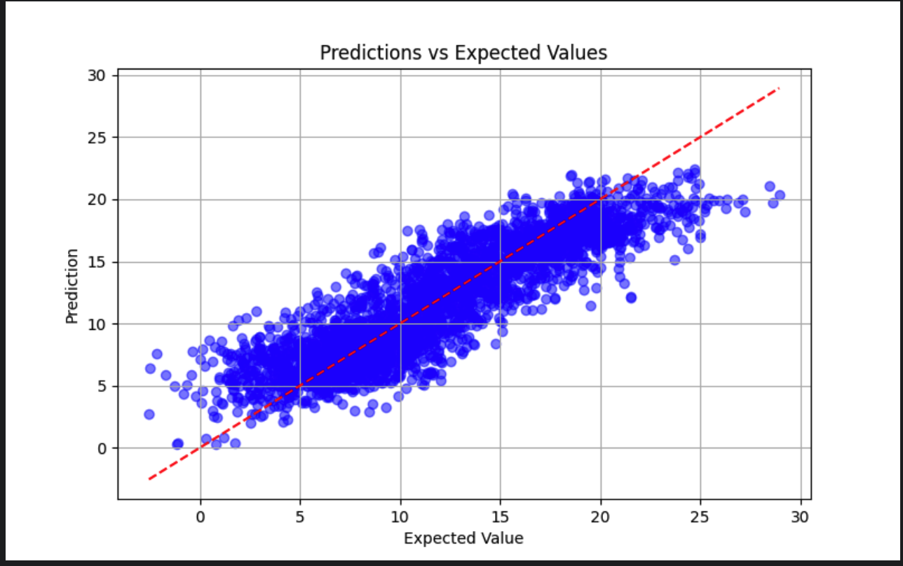
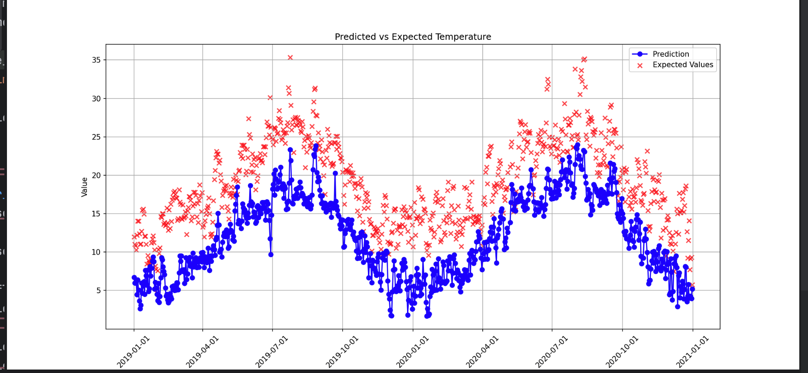

# Predicting London’s Weather: ML Model Lifecycle & Deployment

This project focuses on building a complete Machine Learning (ML) pipeline to
predict the daily mean temperature in London.
It incorporates DataOps (via Great Expectations) and MLOps (via MLflow),
ensuring data quality, model tracking, and deployment.

## Source Data

We are using the London Weather Dataset available on Kaggle:
https://www.kaggle.com/datasets/emmanuelfwerr/london-weather-data
This dataset spans from 1979 to 2021 and has been pre-cleaned for ease of use.

## Data Operations (DataOps)

We utilize Great Expectations to validate data quality at different stages:
Raw Data Validation: Ensuring integrity before processing.
Baseline Data Validation: Checking cleaned data post-ETL (Extract, Transform, Load)

Reference: https://docs.greatexpectations.io/docs/reference/learn/data_quality_use_cases/dq_use_cases_lp

## Machine Learning Model

Our primary model is XGBoost (Extreme Gradient Boosting), a high-performance model for tabular data. We will compare its
performance against other models, such as Random Forest.

Reference: https://www.qwak.com/post/xgboost-versus-random-forest

## Machine Learning Operations (MlOps)

We use Mlflow to manage the ML lifecycle:
Track ML experiments and compare model parameters.
Version control to identify the best-performing models.

Reference: https://mlflow.org/docs/2.7.0/what-is-mlflow.html

## Mlflow Deployment

Mlflow will be used as a local inference server:
Reference:
Reference: https://mlflow.org/docs/2.7.0/what-is-mlflow.html#:~:text=MLflow%20is%20a%20versatile%2C%20expandable,%2C%20algorithm%2C%20or%20deployment%20tool

## Data Visualization (Optional)

Using Matplotlib, we will create visualizations to gain insights from the dataset.

## Considerations & documentation

This is a regression problem, as we aim to predict a continuous variable (temperature).
You can learn more about regression from this link:
https://www.geeksforgeeks.org/regression-in-machine-learning/

Here are some key metrics we will use to evaluate the error of the XGBoost model:
https://dev.to/mondal_sabbha/understanding-mae-mse-and-rmse-key-metrics-in-machine-learning-4la2

If you're interested in learning more about MLOps, check out this resource:
https://christophergs.com/machine%20learning/2020/03/14/how-to-monitor-machine-learning-models/

Mlflow model as a local inference server:
https://mlflow.org/docs/latest/deployment/deploy-model-locally.html

### Data challenges in Real-world Applications

While this dataset is pre-cleaned, real-world data is often:  
Noisy (contains errors or inconsistencies)
Dynamic (changes over time)  
Subject to data drift, which can degrade model performance over time.

Reference to data drift phenomenon:
https://towardsdatascience.com/machine-learning-in-production-why-you-should-care-about-data-and-concept-drift-d96d0bc907fb/

# Assignement

1. Run the data validation on the raw data: london_waether.csv
   is possible to run it from run_great_expectations_raw() present in gx_data_validation.py.
   NB: when you run this function you should se a tab opening such as this one:

   

   This run will give some error, data should be fixed in order to pass the first raw validation.
   You can also improve the suite adding some extra rules.

2. Check the rules of the Great Expectation Baseline Suite. You can notice the presence of some columns which is missing
   in the raw data, this is the part of feature engineering. Implement the function execute_feat_engineering() in
   feature_engineering.py
   in order to be compliant to the baseline rules. You should also add some rules to this suite, use the raw suite as an
   example!

3. From the code you can see a model_xgboost_training.py run this file to train the model.
   This model will be logged and versioned in Mlflow. You should add another file: "model_random_forest_training.py"
   this file should implement another model, named random forest, you can find the some details of this model in the
   section "Machine Learning Model"
   of this readme. Which one respect to random forest and xgboost perform better? why? study the link at the proposed
   section.
   NB: with mlflow you can compare the models, take example from this screenshot:

   
   NB: to be able to perform this you should run mlflow as a local server. Please run this command on your terminal:
   mlflow server --host 127.0.0.1 --port 8080
   NB: when you train the model you should notice some plot popping, please inspect them!
   They should look like these images:

   
   
   

4. [Optional] Choose the model which is the best in your opinion and serve in Mlflow local mode,
   you can find the reference at Mlflow Deployment section.
   Tip: you should run a command like mlflow models serve -m runs:/{ru_id}/model -p 5000.
   NB: it may ask you to run this: export MLFLOW_TRACKING_URI=http://localhost:8080
   In order to access to the saved model.
   Once the model has been deployed you can run some inference on it.
   You can run model_xgboost_serving.py it will plot a matplotlib which you can inspect!
   There is a commented metohd: "simulate_global_warming"
   De-comment it and run again the script, you will see that the curves now are not close as before.
   We just simulate a data drift behaviour!
   The drift in the temperature should be something like this image:

   

5. [Optional] Add functions to 'london_weather.csv' in order to show some trends and features
   of the data.
   Tip: you can find a first example in the file, can you show us some additional behaviour?
